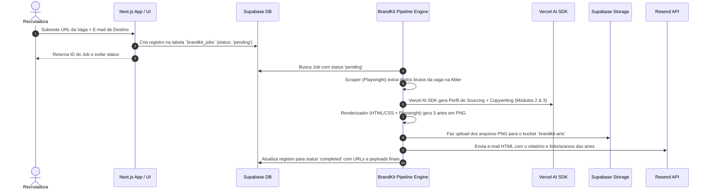

# 🚀 Spec de Design Técnico: Jobz BrandKit Engine (MVP - Subprojeto 1)

**Data:** 27 de Julho de 2026  
**Status:** Aprovado para Implementação  
**Autor:** Antigravity & Equipe Jobz  

---

## 1. Visão Geral do Produto & Escopo do Subprojeto 1

O **Jobz BrandKit Engine** é um sistema de Recruitment Marketing & Sourcing Intelligence que transforma URLs de vagas da Abler em kits completos de divulgação contendo:
- **Relatório de Sourcing Estratégico** (Perfil ideal do candidato, faculdades de referência, guia de triagem e scripts de abordagem fria).
- **Copywriting para Redes Sociais** (Headlines de impacto, bullets hierarquizados e legenda formatada para Instagram/LinkedIn).
- **Artes Visuais PNG** (Instagram Feed 1080x1080, Instagram Story 1080x1920, LinkedIn Banner 1200x627).
- **Entrega Automática** via E-mail Transacional (Resend) e persistência de dados no **Supabase (PostgreSQL + Storage)**.

No **Subprojeto 1 (MVP)**, o foco é a entrega end-to-end do fluxo:  
Formulário Web (Next.js) → Processamento Assíncrono do Pipeline (Playwright + LLM + Renderizador) → Supabase DB/Storage → Disparo de E-mail via Resend.

---

## 2. Arquitetura de Módulos & Topologia do Sistema

---

## 3. Modelo de Dados & Armazenamento (Supabase)

### Tabela PostgreSQL: `brandkit_jobs`
- `id`: `uuid` DEFAULT `gen_random_uuid()` PRIMARY KEY
- `job_url`: `text` NOT NULL (URL da vaga na Abler)
- `recipient_email`: `text` NOT NULL (E-mail para entrega do kit)
- `status`: `text` NOT NULL DEFAULT `'pending'` (Valores: `'pending'`, `'processing'`, `'completed'`, `'failed'`)
- `extracted_data`: `jsonb` NULL (Dados brutos extraídos pelo Playwright)
- `sourcing_profile`: `jsonb` NULL (Perfil ideal, faculdades de referência, hashtags, perguntas de entrevista)
- `copy_data`: `jsonb` NULL (Headlines, tópicos, CTA e legenda completa)
- `asset_urls`: `jsonb` NULL (URLs públicas no Supabase Storage para `feed`, `story` e `linkedin`)
- `error_message`: `text` NULL (Descrição de erro em caso de falha)
- `created_at`: `timestamptz` NOT NULL DEFAULT `now()`
- `completed_at`: `timestamptz` NULL

### Bucket do Supabase Storage: `brandkit-arts`
- **Configuração:** Bucket Público (Public Bucket)
- **Estrutura de Caminho:** `jobs/<job_id>/feed.png`, `jobs/<job_id>/story.png`, `jobs/<job_id>/linkedin.png`

---

## 4. Módulos Internos do Engine

### Módulo 1: Scout Engine (Scraper Abler)
- **Tecnologia:** Playwright Headless Node.js.
- **Entrada:** `job_url` (Abler ATS).
- **Extração:** Título do cargo, localização, modalidade, salário/bolsa, benefícios, jornada, requisitos e atividades.

### Módulo 2 & 3: AI Sourcing Profiler & Copy Engine
- **Tecnologia:** Vercel AI SDK (`ai` e `@ai-sdk/openai` / `@ai-sdk/google`).
- **Validação:** Saída estruturada tipada estritamente via `zod` schema.
- **Entregáveis:**
  - Perfil Ideal da Candidata & Soft/Hard Skills.
  - Faculdades e grupos regionais recomendados para sourcing.
  - Roteiro de Triagem (3 perguntas chave) e scripts de abordagem direta.
  - Textos das 3 artes (Headline, subtítulo, 4 diferenciais em tópicos, CTA).
  - Legenda formatada com emojis e hashtags para Instagram e LinkedIn.

### Módulo 4: Canvas HTML-to-Image Engine
- **Tecnologia:** Template HTML/CSS dinâmico + Screenshot Pixel-Perfect via Playwright.
- **Design System Jobz:**
  - **Fundo Primário:** `#F2F5F8`
  - **Texto Secundário / Títulos:** `#111317`
  - **Accent Jobz:** `#1E81FE`
  - **Tipografia:** `Plus Jakarta Sans` (Google Fonts)
- **Formatos:**
  - Instagram Feed: `1080 × 1350 px`
  - WhatsApp Card: `1080 × 1080 px`
  - Instagram Story: `1080 × 1920 px`
  - LinkedIn Banner: `1200 × 627 px`

### Módulo 5: Hub de Distribuição
- **Tecnologia:** Resend SDK (`resend`).
- **Ação:** Envio de e-mail com layout HTML responsivo apresentando o relatório da vaga, links para download e cópia da legenda pronta para publicação.

---

## 5. Tratamento de Erros & Resiliência

- **Fallbacks no Scraper:** Timeout de 15s com seletores alternativos para lidar com variações da interface Abler.
- **Tratamento de Exceções:** Em caso de erro na extração, LLM ou upload, o status do Job é atualizado para `'failed'` com a respectiva `error_message`.
- **Chaves de API Isoladas:** Variáveis em `.env` (`SUPABASE_URL`, `SUPABASE_SERVICE_ROLE_KEY`, `RESEND_API_KEY`, `OPENAI_API_KEY` ou `GOOGLE_GENERATIVE_AI_API_KEY`).

---

## 6. Plano de Verificação & Testes

1. **Scraper Test:** Executar a extração com URLs reais da Abler e verificar os dados brutos no JSON.
2. **AI Engine Test:** Validar a geração do relatório e copy estruturado via Zod Schema.
3. **Renderizer Test:** Inspecionar e validar os arquivos PNG gerados nas dimensões `1080x1080`, `1080x1920` e `1200x627`.
4. **Pipeline E2E Test:** Submeter vaga pelo formulário web e checar o recebimento do e-mail e persistência no Supabase.
