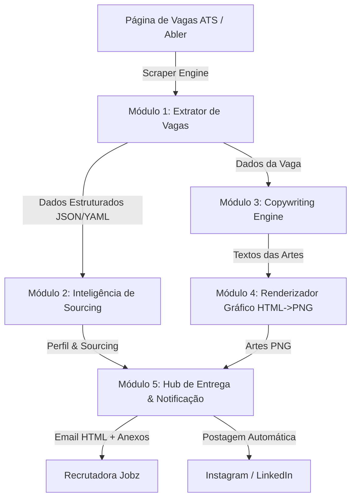

# 🚀 Arquitetura & Especificação do Sistema: Jobz BrandKit Engine

## 1. Visão Geral do Produto

O **Jobz BrandKit Engine** é uma plataforma SaaS interna de **Recruitment Marketing & Sourcing Intelligence** criada para automação do fluxo de atração de talentos da **Jobz**.

O sistema transforma qualquer vaga publicada em um sistema ATS (como a Abler) em um **Kit de Divulgação Completo** em segundos, unindo:
- **Artes Visuais de Alto Impacto** com a identidade visual exata da marca (Instagram Post, Story e LinkedIn).
- **Inteligência Estratégica de Recrutamento** (perfil ideal do candidato, mapeamento de faculdades/grupos locais, estratégia de abordagem ativa e roteiro de triagem).
- **Notificação & Entrega Automática** via e-mail e integração direta com redes sociais.

---

## 2. Arquitetura de Módulos do Sistema

---

### Módulo 1: Web Scraper & Ingestão de Vagas (Scout Engine)
- **Função:** Monitorar ou receber URLs de vagas e extrair os dados brutas de forma estruturada.
- **Entrada:** URL ou Slug da vaga na Abler (ex: `ats.abler.com.br/jobs/jobz?slug=vaga-123`).
- **Tecnologia:** Headless Browser (Playwright / Puppeteer).
- **Dados Extraídos:**
  - Título do Cargo, Localização, Modalidade (Presencial/Híbrido/Remoto).
  - Faixa Salarial / Bolsa Auxílio, Benefícios e Jornada de Trabalho.
  - Requisitos Obrigatórios, Desejáveis e Descrição das Atividades.
  - Vaga Afirmativa / Exclusiva (PCD, Mulheres, etc.).

---

### Módulo 2: Inteligência de Recrutamento (AI Sourcing Profiler)
- **Função:** Processar os dados da vaga e gerar o plano estratégico de hunting e seleção.
- **Tecnologia:** LLM Engine (OpenAI GPT-4o / Claude 3.5 Sonnet / Gemini 1.5 Pro via API com Prompt Engineering especializado em RH no Brasil).
- **Entregáveis:**
  1. **Perfil Ideal da Candidata:** Nível de escolaridade, período universitário ideal, localização prioritária e soft/hard skills.
  2. **Mapa de Sourcing Local:** Faculdades de referência na região (ex: UVV, UFES, FAESA), grupos de estudantes e hashtags/palavras-chave para busca no LinkedIn.
  3. **Templates de Abordagem Direct/InMail:** Copy pronto para abordagem fria destacando os diferenciais competitivos da vaga.
  4. **Guia de Triagem:** *Green flags*, *Red flags* e 3 perguntas matadoras para a entrevista inicial.

---

### Módulo 3: Gerador de Copywriting para Mídias Sociais (Copy Engine)
- **Função:** Sintetizar e adaptar os textos da vaga para formatos visuais de leitura rápida (3 segundos) e criar legendas de engajamento.
- **Entregáveis:**
  - Textos hierarquizados para a arte (Headline max 8 palavras, Subtítulo, 4 Destaques em tópicos, Tag Afirmativa e CTA).
  - Legenda pronta para publicação no Instagram e LinkedIn (com formatação profissional de emojis e hashtags estratégicas).

---

### Módulo 4: Renderizador Gráfico Automático (Canvas/HTML-to-Image Engine)
- **Função:** Transformar o copy em imagens PNG de alta resolução respeitando o *Brand Guidelines* da Jobz.
- **Especificações de Design (Jobz Identity):**
  - **Cores:** Fundo Primário `#F2F5F8`, Texto Secundário `#111317`, Accent `#1E81FE`, Destaque Afirmativa `#8C00FF`.
  - **Tipografia:** Plus Jakarta Sans (Google Fonts).
  - **Tamanhos Suportados:**
    - Post Feed Instagram (1080 × 1080 px)
    - Story Instagram (1080 × 1920 px)
    - Banner LinkedIn (1200 × 627 px)
- **Mecanismo:** Renderização via HTML/CSS dinâmico + captura de screenshot via Playwright (Pixel-Perfect).

---

### Módulo 5: Hub de Entrega & Distribuição (Distribution Hub)
- **Função:** Entregar o pacote final para a recrutadora e/ou publicar nas redes sociais.
- **Canais:**
  - **E-mail Transactional (Resend API):** Envia um e-mail HTML com o relatório da vaga e as artes anexadas.
  - **Integração com Redes Sociais (Meta Graph API / Blotato / Instagram Graph API):** Agendamento ou publicação imediata no feed e stories.

---

## 3. Fluxo Completo do Usuário (User Journey)

1. **Gatilho:** A recrutadora cadastra uma nova vaga na Abler ou simplesmente envia o link no sistema/WhatsApp.
2. **Processamento (15 a 30 segundos):**
   - O Scraper lê a vaga na Abler.
   - A IA gera o perfil de sourcing e os textos das artes.
   - O renderizador cria as imagens em PNG.
3. **Validação / Preview:** A recrutadora visualiza o preview das artes e do texto no painel ou WhatsApp.
4. **Disparo:** Com 1 clique em "Aprovar":
   - O e-mail com o kit completo chega na caixa de entrada da recrutadora.
   - As artes podem ser baixadas ou postadas diretamente no Instagram/LinkedIn da Jobz.

---

## 4. Stack Tecnológica Recomendada para Desenvolvimento

| Camada | Tecnologias Sugeridas |
|---|---|
| **Backend / API** | Node.js (TypeScript) ou Python (FastAPI / NestJS) |
| **Web Scraping** | Playwright Node.js / Python |
| **IA / Prompts** | LangChain / Vercel AI SDK conectando com OpenAI / Anthropic / Gemini |
| **Renderização de Artes** | HTML/CSS + Playwright Screenshot (ou Satori / `@vercel/og` / Canvas) |
| **Envio de E-mail** | Resend API (`resend` SDK) |
| **Frontend / Dashboard** | Next.js + TailwindCSS + Shadcn/UI |
| **Banco de Dados** | PostgreSQL (Supabase) + Prisma ORM |

---

## 5. Roadmap de Funcionalidades Futuras (V2 & V3)

1. **Dashboard de Recrutadoras:** Painel web onde toda a equipe da Jobz vê os kits gerados de todas as vagas ativas.
2. **Postagem Automática Agendada:** Agendar postagens no Instagram/LinkedIn no horário de maior pico do público-alvo.
3. **Disparo no WhatsApp da Recrutadora:** Enviar o relatório e as artes diretamente no WhatsApp via API Oficial / Z-API.
4. **Gerador de Banco de Candidatos:** Cruzar o perfil ideal da IA com cadastros existentes para sugerir candidatos pré-qualificados do próprio banco da Jobz.
